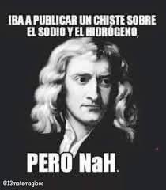
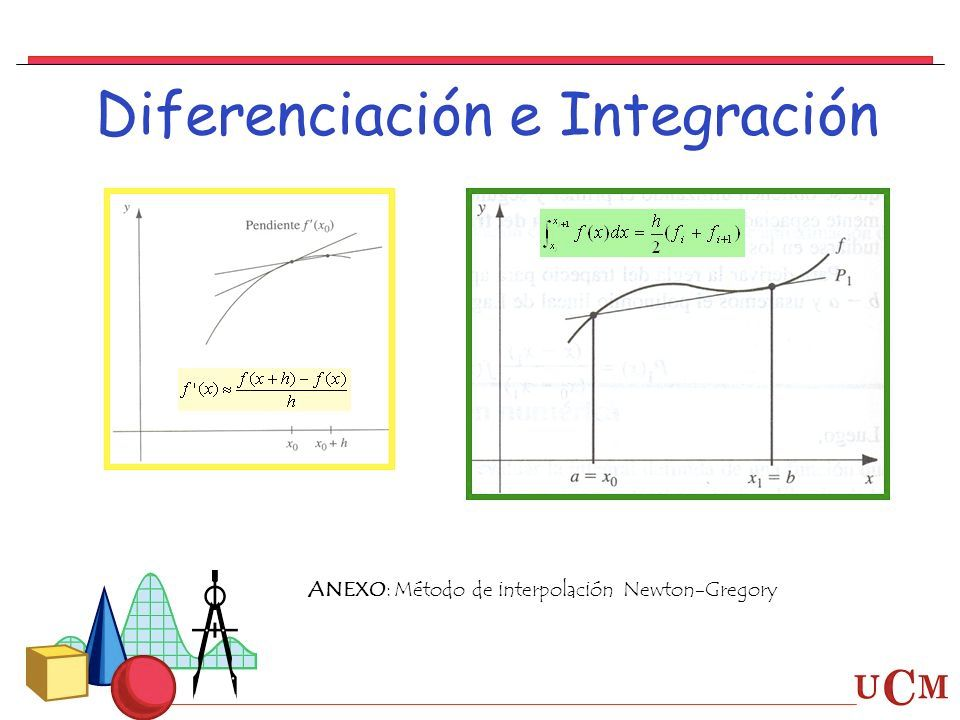
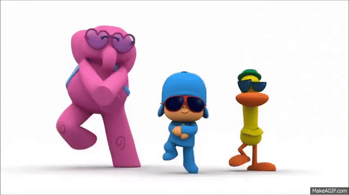

# *Actividades Realizadas en el emestre*
---
---
 **_Programación Numérica_**

>**_TAREA 1_**
>_"Repaso de programación"_
>1. [Ejercicios de la Tarea](https://github.com/NestorHB20/Proyecto_Final/blob/main/PN%20Tarea%201.py)

>**_TAREA 2_**
>_"Raíces de ecuaciones, parte I"_
>1. [Ejercicio de newton raphson](https://github.com/NestorHB20/Proyecto_Final/blob/main/newtonraphson%20(1).fig)
>2. [Ejercicio de descop](https://github.com/NestorHB20/Proyecto_Final/blob/main/descop%20(1).fig)

>**_TAREA 3_**
>_"Raíces de ecuaciones, parte II"_
>1. [Ejercicio de falsa posicion](https://github.com/NestorHB20/Proyecto_Final/blob/main/MetFP%20(1).mlx)
>2. [Ejercicio de birge vieta](https://github.com/NestorHB20/Proyecto_Final/blob/main/MetBV%20(1).mlx)

>**_TAREA 4_**
>_"Sistemas de ecuaciones lineales"_
>1. [_Ejercico de choleshy_](https://github.com/NestorHB20/Proyecto_Final/blob/main/Choleshy.py)
>2. [_Ejercico de Descomposicion_](https://github.com/NestorHB20/Proyecto_Final/blob/main/Descomposicion%20Lu.py)
>3. [_Ejercico de Gauss Jordan_](https://github.com/NestorHB20/Proyecto_Final/blob/main/GaussJordan.py)
>4. [_Ejercico del Metodo de Cramer_](https://github.com/NestorHB20/Proyecto_Final/blob/main/MD%20cramer.py)
>5. [_Ejercico de Matriz inversa_](https://github.com/NestorHB20/Proyecto_Final/blob/main/Matriz%20inversa.py)

>**_TAREA 5_**
>_"Integración y diferenciación numéricas"_
>1. [Ejercicios "A"](https://github.com/NestorHB20/Proyecto_Final/blob/main/Tarea5A.py)
>2. [Ejercicios "B"](https://github.com/NestorHB20/Proyecto_Final/blob/44c5751f77d91ef1178d5c055e7549a924c7048c/Tarea5B.py)
>3. [Ejercicios "C"](https://github.com/NestorHB20/Proyecto_Final/blob/44c5751f77d91ef1178d5c055e7549a924c7048c/Tarea5C.py)
>4. [Ejercicios "C, Taylor"](https://github.com/NestorHB20/Proyecto_Final/blob/44c5751f77d91ef1178d5c055e7549a924c7048c/Tarea5CTaylor.py)
>5. [Ejercicios E2](https://github.com/NestorHB20/Proyecto_Final/blob/44c5751f77d91ef1178d5c055e7549a924c7048c/Tarea5E2.py)

>**_TAREA 6_**
>_"Interpolación y Regresión Numéricas"_
>1. [Ejercicio I, Interpolaciones](https://github.com/NestorHB20/Proyecto_Final/blob/main/Ejercicio%20I%2C%20Interpolaciones.py)
>2. [Ejercicio "Regrsion lineal con grafica"](https://github.com/NestorHB20/Proyecto_Final/blob/main/Regresion%20Lineal%20y%20grafica.py)
>3. [Ejercico "Secuencia de datos"](https://github.com/NestorHB20/Proyecto_Final/blob/main/Secuencia%20de%20datos.py)
>4. [Ejercicio II "b"](https://github.com/NestorHB20/Proyecto_Final/blob/main/Ejercicio%20II%20%22b%22.py)
>5. [Ejercicio II "c"](https://github.com/NestorHB20/Proyecto_Final/blob/main/Ejercicio%20II%20%22c%22.py)
>6. [Ejercicio II "d"](https://github.com/NestorHB20/Proyecto_Final/blob/main/Ejercicio%20II%20%22d%22.py)
>7. [Ejercicio II "f"](https://github.com/NestorHB20/Proyecto_Final/blob/main/Ejercicio%20II%20%22f%22.py)

